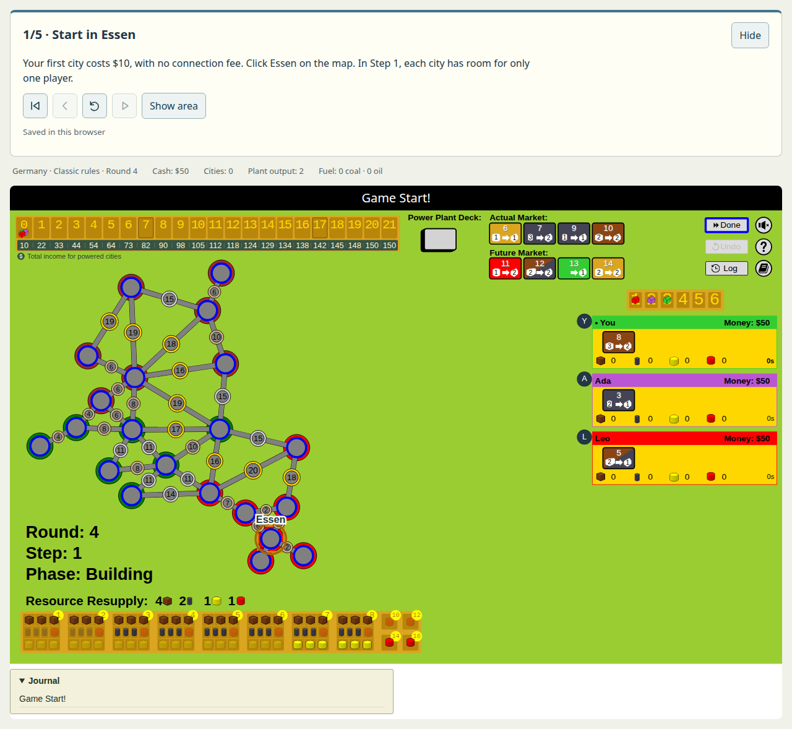
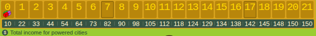
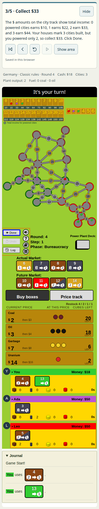

# Tutorial screenshots

Captured from the local tutorial preview using the same bundle as the ordinary viewer.

## Desktop

The connections chapter highlights the city to build while keeping the normal board controls.

## City track

Houses mark cities built. The row below shows total income for that number of powered cities; the track wraps to two rows on portrait phones.

## Mobile

The income chapter distinguishes the three cities built from the two actually supplied with electricity.

